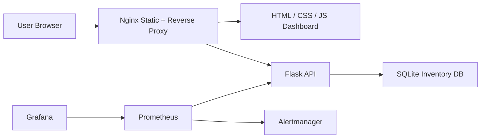

# Inventory Operations Console

A production-style inventory management platform built with Flask, SQLite, Nginx, Docker Compose, Prometheus, and Grafana. It started as a simple CRUD app and was upgraded into a resume-ready systems engineering project that demonstrates observability, authentication, validation, deployment readiness, and operational workflows.

## Overview
- Track inventory by `name`, `sku`, `quantity`, `location`, `category`, and `low_stock_threshold`.
- Surface low-stock risk in a dashboard-oriented frontend.
- Protect write actions with admin authentication and basic rate limiting.
- Capture every create, update, and delete operation in an audit history feed.
- Expose health, readiness, and Prometheus metrics endpoints for production-style monitoring.

## Architecture

## Core Features
- Real inventory records with searchable metadata and low-stock thresholds.
- Modal-based create/edit flows instead of browser prompts.
- Admin sign-in for mutating actions.
- JSON request logging, health checks, and metrics exposure.
- Prometheus alert rules for backend availability, elevated errors, and low-stock events.
- Pre-provisioned Grafana datasource and dashboard.
- CI pipeline for linting, tests, Docker build validation, and Compose validation.

## Project Structure
- [app_server/app.py](/Users/michaelakoto/Desktop/Inventory-Manager/app_server/app.py)
  Flask API, SQLite migrations, auth, validation, logging, and metrics.
- [web_server/static/index.html](/Users/michaelakoto/Desktop/Inventory-Manager/web_server/static/index.html)
  Dashboard shell, modal editor, and authenticated admin controls.
- [docker-compose.yml](/Users/michaelakoto/Desktop/Inventory-Manager/docker-compose.yml)
  Local app, monitoring, and alerting stack.
- [monitoring/prometheus/prometheus.yml](/Users/michaelakoto/Desktop/Inventory-Manager/monitoring/prometheus/prometheus.yml)
  Prometheus scrape configuration and alert wiring.

## Local Setup
1. Copy `.env.example` to `.env` and update the admin credentials and secret key.
2. Start the platform with `make up`.
3. Open:
   - App: [http://localhost:8080](http://localhost:8080)
   - Prometheus: [http://localhost:9090](http://localhost:9090)
   - Grafana: [http://localhost:3000](http://localhost:3000)
4. Sign in with the admin credentials from `.env` to unlock add/edit/delete actions.

## API Surface
- `GET /items`
- `POST /items`
- `PUT /items/:id`
- `DELETE /items/:id`
- `GET /dashboard`
- `GET /history`
- `POST /history/clear`
- `POST /login`
- `POST /logout`
- `GET /session`
- `GET /healthz`
- `GET /readyz`
- `GET /metrics`

## Monitoring Stack
- Prometheus scrapes the Flask backend directly at `/metrics`.
- Grafana provisions a default dashboard named `Inventory Overview`.
- Alert rules cover:
  - backend down
  - high error rate
  - low-stock inventory present
- Alertmanager is included so alerts have a real routing target when you extend notifications later.

## Testing and Quality Checks
- Run API tests with `make test`.
- Run linting with `make lint`.
- Validate Docker builds with `make build`.
- CI runs automatically from [`.github/workflows/ci.yml`](/Users/michaelakoto/Desktop/Inventory-Manager/.github/workflows/ci.yml).

## Backup and Restore
- Create a timestamped SQLite backup with `make backup`.
- Backups are stored in `backups/`.
- To restore, stop the stack and replace `app_server/inventory.db` with the backup you want to recover.

## Deployment Approach
- Fastest public deployment: Render, Railway, or Fly.io by splitting the web and backend services or running the stack behind a single container entrypoint.
- Stronger infrastructure story: deploy to an AWS EC2 instance and run the Compose stack behind a public reverse proxy.
- For production hardening, swap SQLite for PostgreSQL, move secrets to a managed store, and attach real Alertmanager notification channels.

## Suggested Screenshots
- Main inventory dashboard with low-stock cards visible.
- Admin edit modal open on an item.
- Prometheus targets and active alerts page.
- Grafana `Inventory Overview` dashboard.

## Future Improvements
- Replace SQLite with PostgreSQL and add migrations.
- Add role-based access control for operators vs administrators.
- Send low-stock alerts to Slack or email from Alertmanager.
- Add CSV import/export for bulk inventory changes.
